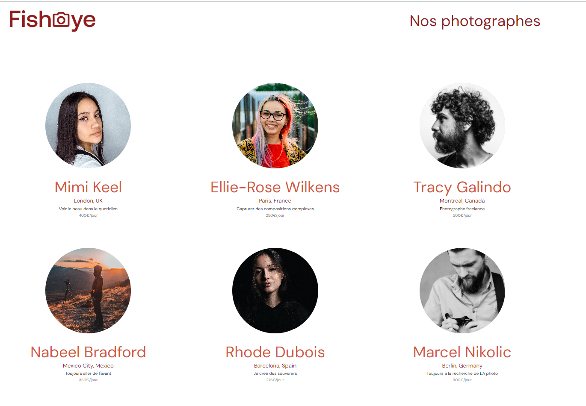

# Projet 6 (Dévelopeur d'application JavaScript React)

# Créez un site accessible pour une plateforme de photographes

# FishAye

## Aperçu de l'Interface

## Description 
un site web qui permet aux photographes indépendants de présenter leurs meilleurs travaux

## Demonstration 
Visiter [FichAye](https://saminedjai.github.io/FishEye/) pour voir le projet en action.

## Technologies Utilisées
- HTML5
- CSS3
- JavaScript
- API Fetch

Rien à installer ici, il suffit d'ouvrir le fichier `index.html`...

